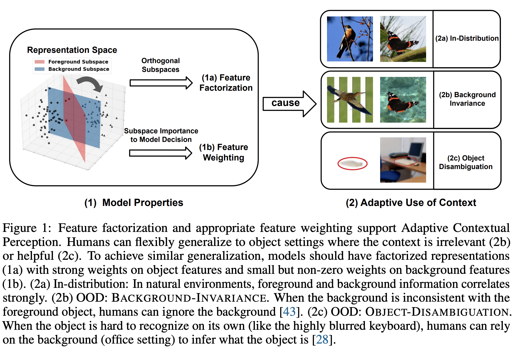

# Adaptive Contextual Perception

The code for paper Adaptive Contextual Perception: How to Generalize to New Backgrounds and Ambiguous Objects

Zhuofan Ying, Peter Hase, Mohit Bansal



## Setup environment and data
### Environment
Create and activate conda environment:
```bash
conda create -n AdaCont python=3.7
conda activate AdaCont
```
Install the dependencies with:
```bash
pip install -r requirements.txt
```
### Setup data
- Download data: 1) [Places dataset](http://data.csail.mit.edu/places/places365/train_256_places365standard.tar) and 2) [COCO dataset](http://images.cocodataset.org/annotations/annotations_trainval2017.zip).
- Preprocess Places and COCO datasets:
```shell
# preprocess COCO
python coco.py
# preprocess Places
python places.py
```
- Create ColorObject and SceneObject dataset, including in-distribution (ID) train, ID val, ID test, Background-Invariance (OOD1) test, Object-Disambiguation (OOD2) test, probing data for probing method, perturbation data for geometric method, and perturbation data for  sets:
```shell
python data_gen.py
```

## Training
- Run scripts in `scripts/` to train all baseline models and augmentation models for our analysis: 
```bash
./scripts/train_color.sh
./scripts/train_scene.sh
```
For all scripts, see `scripts/all_scripts.sh`

## Data Analysis
- To compute feature factorization and feature weighting metrics for models, run `ComputeMetrics.ipynb`. This will save the metrics to `saved_dict_ColorObject.pkl` and `saved_dict_SceneCOCO.pkl`.
- To reproduce our regression and causal analysis, run `RegressionAnalysis.ipynb` and `CausalAnalysis.ipynb`

## Acknowledgement
This code is based on [TRM](https://github.com/Newbeeer/TRM). 

## Citation
